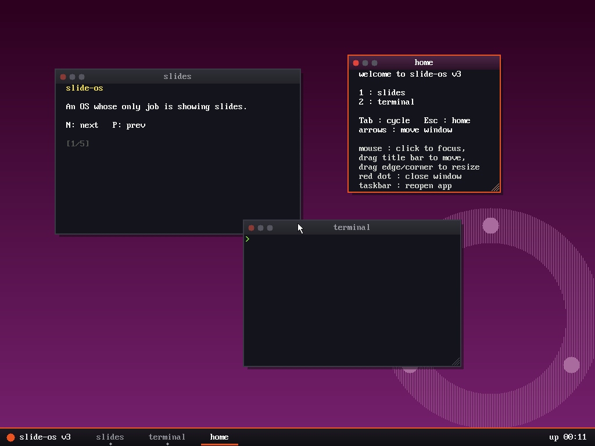
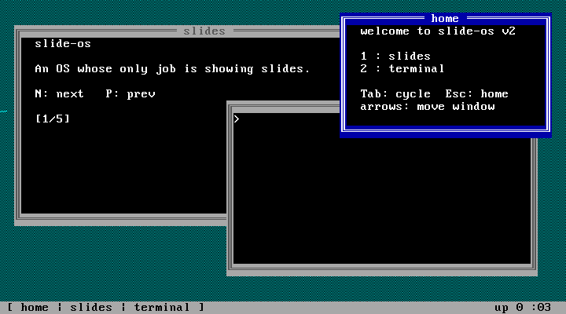
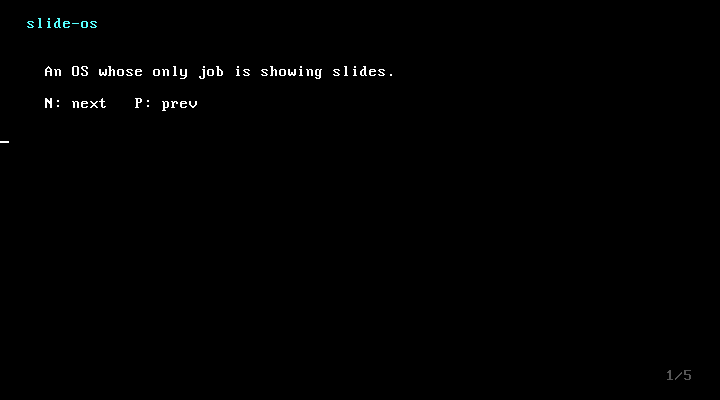

# slide-os

スライドを表示することだけを目的にした、自作OS(風)の学習プロジェクト。

v1 → v2 → v3 の順に発展していて、どのバージョンも同じ5枚のスライドを上映します。

| バージョン                 | 表示                               | 入力                             |
| -------------------------- | ---------------------------------- | -------------------------------- |
| [`kernel_v1/`](kernel_v1/) | VGAテキスト (0xB8000直書き)        | PS/2キーボードをポーリング       |
| [`kernel_v2/`](kernel_v2/) | テキストセルのウィンドウ           | 割り込み駆動のキーボードドライバ |
| [`kernel_v3/`](kernel_v3/) | 1024x768x32bpp フレームバッファGUI | キーボード + PS/2マウス          |

## スクリーンショット

### v3 — フレームバッファGUI



### v2 — テキストウィンドウ + タスクバー



### v1 — VGAテキストのスライド



## クイックスタート (macOS)

```sh
brew install qemu nasm i686-elf-gcc i686-elf-grub

make -C kernel_v3 run-iso    # GRUB入りISOを作ってQEMUで起動
```

ブートスプラッシュのあとデスクトップが表示されます。シリアルログはQEMUの標準出力に出ます。

> v3のGUIは **ISO経由の起動が必須** です。`make -C kernel_v3 run`(`-kernel`直接ロード)は
> Multibootのビデオ要求が無視されるため、防御チェックで停止するのが正常動作です。

### 操作方法

- **slides**: `N` 次のページ / `P` 前のページ
- **キーボード(v2,v3)**: `1` slides / `2` terminal / `Tab` ウィンドウ巡回 / `Esc` home / 矢印キーで移動
- **マウス(v3)**: クリックでフォーカス、タイトルバーをドラッグで移動、端・角をドラッグでリサイズ、赤い点で閉じる、タスクバーから再表示
- **terminal(v2,v3)**: `help` `about` `uptime` `clear`

## 過去バージョンを動かす

```sh
make -C kernel_v1 run    # v1: VGAテキストのスライド (N/Pでページ送り)
make -C kernel_v2 run    # v2: テキストウィンドウ + タスクバー
```

v1の仕組み(ブートからVGA表示まで)の詳しい解説は [kernel_v1/README.md](kernel_v1/README.md) を参照。

## リポジトリ構成

| パス                                                 | 内容                                                                         |
| ---------------------------------------------------- | ---------------------------------------------------------------------------- |
| [`kernel_v3/`](kernel_v3/)                           | 現行。GRUB+Multibootでフレームバッファ、ピクセル描画のウィンドウ、PS/2マウス |
| [`kernel_v2/`](kernel_v2/)                           | 割り込み・タイマー・キーボードドライバ・テキストウィンドウ・ミニターミナル   |
| [`kernel_v1/`](kernel_v1/)                           | 最初の版。Multibootカーネル + VGAテキストでスライド表示                      |
| [`experiments/bootsector/`](experiments/bootsector/) | BIOSが直接実行する512バイトのブートセクタ実験                                |
| [`docs/`](docs/)                                     | 要件メモ([v3-requirements.md](docs/v3-requirements.md))とスクリーンショット  |
| [`tools/`](tools/)                                   | ビットマップフォント抽出スクリプト                                           |

## ブートセクタ実験を動かす

```sh
cd experiments/bootsector
nasm -f bin boot.asm -o boot.bin
qemu-system-i386 -drive format=raw,file=boot.bin
```

## ライセンス

[MIT](LICENSE)
